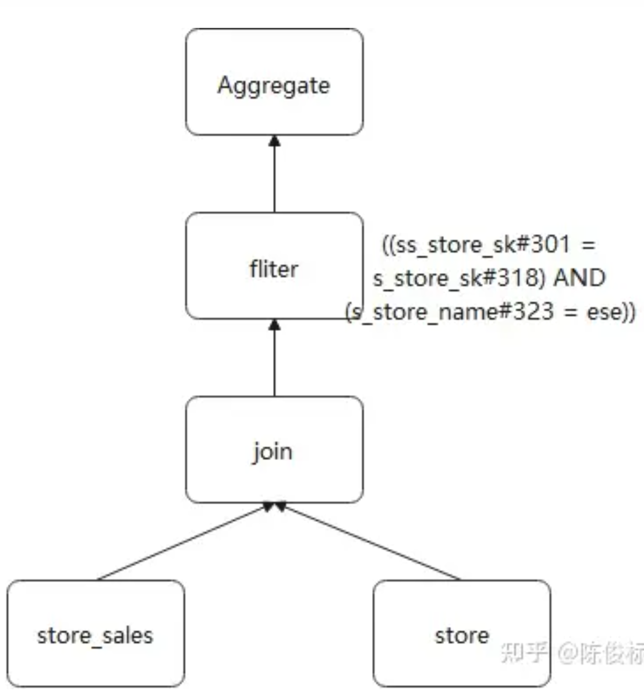
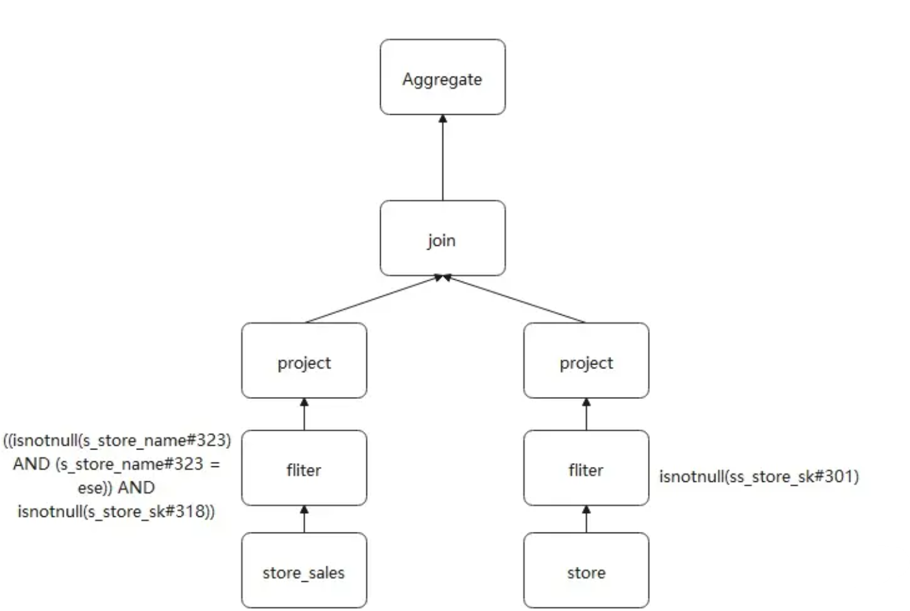
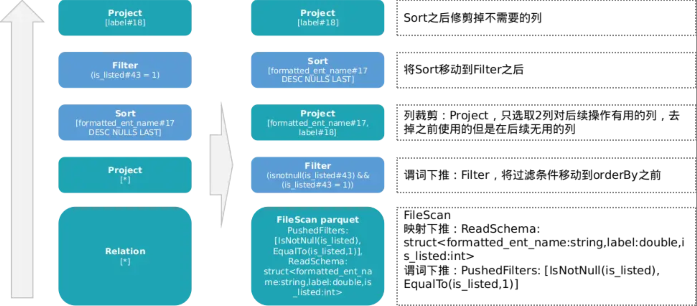
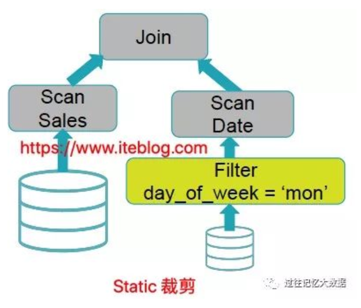
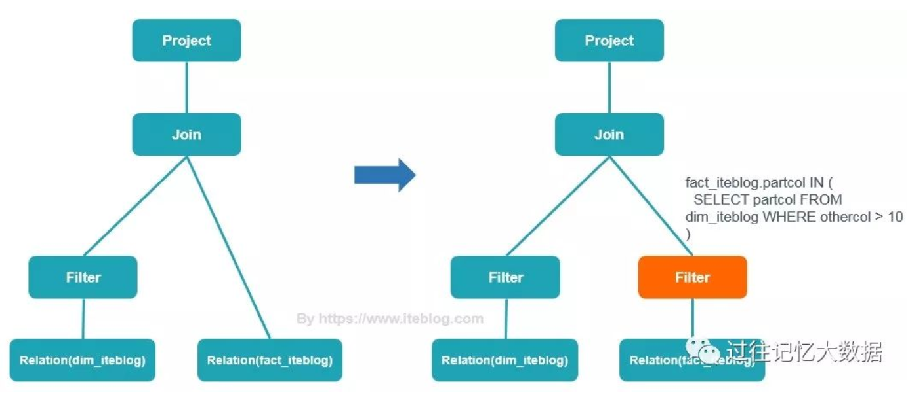
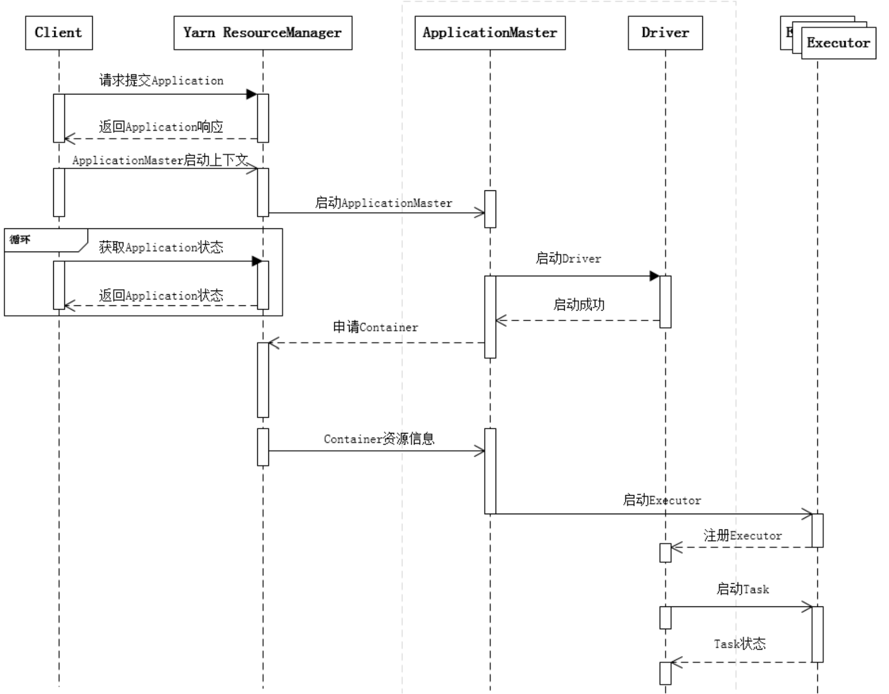

# Spark 2 
## Saprk 编译过程
1. 创建RDD或DataFrame： Spark作业通常从外部数据源（如HDFS、数据库或本地文件系统）创建初始的RDD（弹性分布式数据集）或DataFrame。这些RDD或DataFrame包含了初始数据。

2. 应用转换操作： 一旦数据加载到RDD或DataFrame中，就能应用各种转换操作，如map、filter、groupByKey等，以进行数据的转换和处理。这些操作构成了逻辑执行树的节点。

3. 依赖关系建立：Spark会记录这些操作之间的依赖关系。这些依赖关系定义了作业中的数据流。例如，一个map操作可能依赖于前一个filter操作的结果。

4. 逻辑执行树构建： 在构建逻辑执行树时，Spark将这些操作和它们的依赖关系组织成一个有向无环图（DAG）。每个节点表示一个操作，每个边表示依赖关系。这个DAG即为逻辑执行树。

5. 优化： 一旦构建了逻辑执行树，Spark优化器会尝试对逻辑执行树进行优化，以提高性能。它可以应用诸如谓词下推、投射下推等优化规则，以减少数据的移动和不必要的计算。

6. 物理执行计划生成 + 优化： 优化后的逻辑执行树被转换为物理执行计划，该计划定义了如何在Spark集群上执行作业。物理执行计划考虑了数据分片、任务调度、数据本地性等因素。

7. 执行作业： 最后，Spark根据生成的物理执行计划在集群上执行作业。这涉及将任务分发到集群中的各个工作节点，执行数据的转换和计算，并将结果返回给驱动程序。

### 谓词下推
什么是谓词：where后面的操作。

谓词下推（Predicate PushDown），即将查询的过滤条件尽可能下沉到数据源。目的是为了减少非必须数据的读取。比如做完筛选之后再做join操作，可能就能从十万条变成一万条。


通过对比，下推后，filter算子距离数据表更近了，这个就是谓词下推。
### 列裁剪 Column Pruning 
列裁剪和映射下推的目的：过滤掉查询不需要使用到的列
列裁剪ColumnPruning 指把那些查询不需要的字段过滤掉，使得扫描的数据量减少。
### 映射下推 Project PushDown
如果底层的文件格式为列式存储（比如 Parquet），则可以进一步映射下推，映射可以理解为表结构映射，
TODO: project是啥？？【可能是select】relation是啥？对应的代码和逻辑执行树物理执行树是啥？

### 聚合下推（加一个例子）
聚合下推是将聚合函数Count，Max，Min，Sum，avg进习惯下推给数据源，利用数据源自己本身的聚合功能进行聚合求值，将求值结果返回给查询引擎，可以极大的减小数据传输开销，同时可以大大节省内存的使用；

### OrderBy,Limit下推（加一个例子）
这两个下推的意义与上述类似，对于这两个谓词下推到数据源，使数据源在进行数据返回的时候，返回一系列有序的元组或者是所要求的前几条元组，这样便可以节省查询引擎进行复杂的排序开销以及获取不必要的数据量；

## 剪枝
### 静态分区裁剪（Static Partition Pruning）（缺图片）
MT 提交上去，结合DAG，

```SELECT * FROM Sales_iteblog WHERE day_of_week = 'Mon'```


将 day_of_week = 'Mon' 的数据全部拿出来，其他数据不需要的拿出，这样 Spark SQL 中处理的数据就变少了，整个 SQL 的查询数据就会变快，这一切都是编译的时候（compile time）进行的，所以这个叫做静态分区裁剪（Static Partition Pruning）。

### 动态分区裁剪（Dynamic Partition Pruning）
todo：逻辑执行树和物理执行树。嵌套查询

```
SELECT * FROM dim_iteblog 
JOIN fact_iteblog 
ON (dim_iteblog.partcol = fact_iteblog.partcol) 
WHERE dim_iteblog.othercol > 10
```
动态分区裁剪就是基于运行时（run time）推断出来的信息来进一步进行分区裁剪。

Spark 能够在运行的时候先对 fact_iteblog 表的 partcol 进行了一次过滤，然后再和 dim_iteblog 表进行 Join

#### 为什么嵌套查询的速度反而更快呢？
会生成一个较小的表，而不是采用整个完整的表。
我们不需要实际扫描整个事实表。为了做到这种优化，一种简单的方法是通过维度表构造出一个过滤子查询（比如上面例子为 select * from fact_iteblog where xxx），然后在扫描事实表之前加上这个过滤子查询。

### 宽依赖 vs 窄依赖

判断窄依赖的依据就是：父类分区内的数据，会被子类RDD中的指定的 **唯一一个** 分区所消费

## Spark 任务调度

### RDD是弹性数据集，“弹性”体现在哪里呢？

+ 自动进行内存和磁盘切换
+ task如果失败会特定次数的重试：计算出错重试机制;
+ stage如果失败会自动进行特定次数的重试，而且只会只计算失败的分片
+ checkpoint【每次对RDD操作都会产生新的RDD，如果链条比较长，计算比较笨重，就把数据放在硬盘中】和persist 【内存或磁盘中对数据进行复用】(检查点、持久化)
+ 数据调度弹性：DAG TASK 和资源管理无关（todo:加一些例子）：内存与磁盘的自动切换;
+ 数据分片的高度弹性repartion（todo:加一些例子）：可根据需要重新分片。
### RDD缺陷
惰性计算的缺陷也是明显的：中间数据默认不会保存，每次动作操作都会对数据重复计算，某些计算量比较大的操作可能会影响到系统的运算效率

### RDD有多少种持久化方式？
cache和persist


### code to 逻辑执行树。DAG变成树的过程
### MT上的图是怎么对应的 。
hdfs和rdd 的区别联系
什么情况下会拆分。driver去做dag的生成，怎么生成partition。
