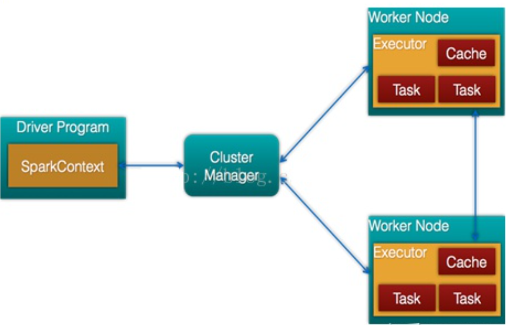
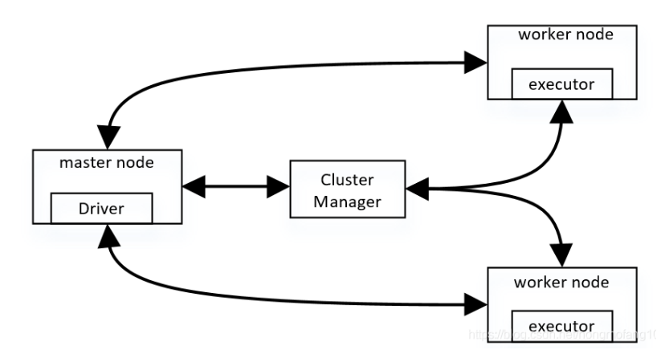
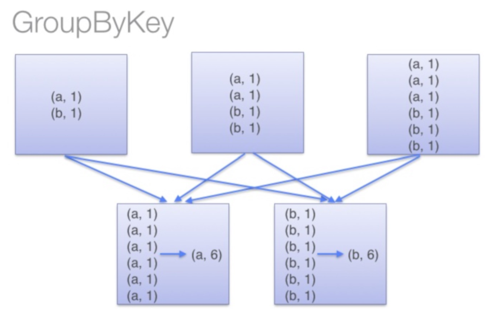
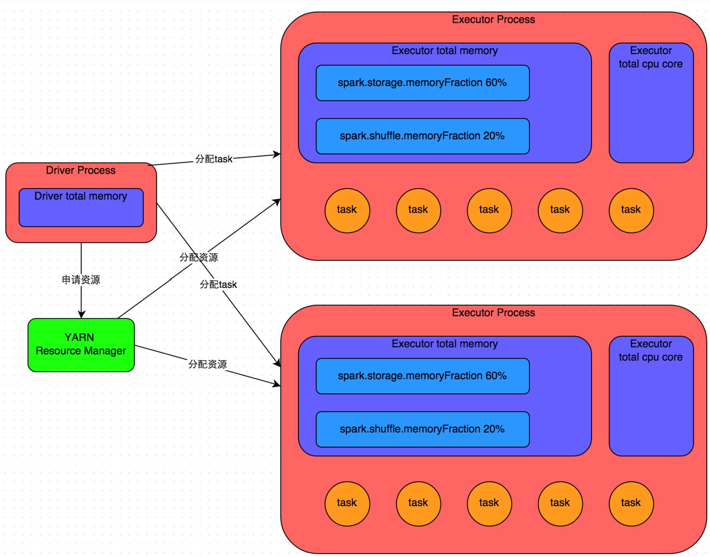

# Spark

<!-- GFM-TOC -->

<!-- GFM-TOC -->
- [Spark](#spark)
  - [Spark的基础架构？](#spark的基础架构)
    - [Driver是怎么去调用excutor的?](#driver是怎么去调用excutor的)
      - [driver，executor，master，worker之间的关系?](#driverexecutormasterworker之间的关系)
    - [对于多个excutor是怎么配置的？](#对于多个excutor是怎么配置的)
      - [什么是RDD？](#什么是rdd)
    - [Spark启动一个application的过程](#spark启动一个application的过程)
    - [RDD的运行过程](#rdd的运行过程)
  - [如何优化Spark的计算?](#如何优化spark的计算)
    - [持久化策略](#持久化策略)
    - [Shuffle 算子优化](#shuffle-算子优化)
      - [coalesce](#coalesce)
      - [使用 broadcast 替代 join：](#使用-broadcast-替代-join)
      - [换方法(distinct and group by)：](#换方法distinct-and-group-by)
        - [为什么？](#为什么)
      - [Group by and reduceByKey](#group-by-and-reducebykey)
        - [为什么？](#为什么-1)
      - [使用filter之后进行coalesce操作](#使用filter之后进行coalesce操作)
      - [使用repartitionAndSortWithinPartitions替代repartition与sort类操作](#使用repartitionandsortwithinpartitions替代repartition与sort类操作)
      - [广播大变量](#广播大变量)
        - [为什么广播能起到优化的效果呢？](#为什么广播能起到优化的效果呢)
  - [高级调优方法](#高级调优方法)
    - [解决方案一：使用Hive ETL预处理数据](#解决方案一使用hive-etl预处理数据)
    - [解决方案二：过滤少数导致倾斜的key](#解决方案二过滤少数导致倾斜的key)
    - [解决方案三：提高shuffle操作的并行度](#解决方案三提高shuffle操作的并行度)
    - [如何判断数据倾斜？](#如何判断数据倾斜)
  - [Spark参数](#spark参数)
  - [常见参数](#常见参数)
    - [num-executors / -numExecutors](#num-executors---numexecutors)
    - [executor-memory / executorMemory](#executor-memory--executormemory)
    - [executor-cores / executorCores](#executor-cores--executorcores)
    - [driver-memory](#driver-memory)
    - [spark.storage.memoryFraction](#sparkstoragememoryfraction)
  - [重要参数](#重要参数)
    - [spark.default.parallelism](#sparkdefaultparallelism)
    - [spark.shuffle.memoryFraction](#sparkshufflememoryfraction)
    - [spark.shuffle.io.maxRetries](#sparkshuffleiomaxretries)
    - [spark.shuffle.io.retryWait](#sparkshuffleioretrywait)

------

## Spark的基础架构？

Cluster Manager：在standalone模式中即为Master主节点，控制整个集群，监控worker。在YARN模式中为资源管理器

Worker节点：从节点，负责控制计算节点，启动Executor或者Driver。

Driver： 运行Application 的main()函数

Executor：执行器，是为某个Application运行在worker node上的一个进程

### Driver是怎么去调用excutor的?

展开

driver首先会向集群管理者（standalone、yarn，mesos）申请spark应用所需的资源，也就是executor，然后集群管理者会根据spark应用所设置的参数在各个worker上分配一定数量的executor，每个executor都占用一定数量的cpu和memory。在申请到应用所需的资源以后，driver就开始调度和执行我们编写的应用代码了。
driver进程会将我们编写的spark应用代码拆分成多个stage，每个stage执行一部分代码片段，并为每个stage创建一批tasks，然后将这些tasks分配到各个executor中执行。

1. 客户端提交作业
2. Driver启动流程
3. Driver申请资源并启动其余Executor(即Container)
4. Executor启动流程
5. 作业调度，生成stages与tasks。
6. Task调度到Executor上，Executor启动线程执行Task逻辑
7. Driver管理Task状态
8. Task完成，Stage完成，作业完成

#### driver，executor，master，worker之间的关系?

展开

从物理层面的节点上划分，有master和worker两钟节点。一台机器可以既作为master又作为worker
从进程上划分，driver 就是main函数并且会创建sparkContext 对象
driver可以运行在master上，也可以运行worker上（根据部署模式的不同）。

### 对于多个excutor是怎么配置的？

展开

executor进程宿主在worker节点上，一个worker可以有多个executor。每个executor持有一个线程池，每个线程可以执行一个task，executor执行完task以后将结果返回给driver，每个executor执行的task都属于同一个应用。

此外executor还有一个功能就是为应用程序中要求缓存的 RDD 提供内存式存储，RDD 是直接缓存在executor进程内的，因此任务可以在运行时充分利用缓存数据加速运算。

#### 什么是RDD？
RDD的英文全名是Resilient Distributed Dataset，弹性分布式数据集

展开

根据spark的源码, 一个RDD当中包含以下内容：

+ 它是一组分区，分区是spark中数据集的最小单位。
+ 数据和计算之间的映射关系就存储在RDD中。

基于以上内容，新的更加清晰的架构图

Spark_overview_clear.png

### Spark启动一个application的过程
1. 构建Spark Application的运行环境，启动SparkContext 

    #### 如何对应到Spark架构图中？
    

    
展开

    Driver启动
    

2. SparkContext向资源管理器（可以是Standalone，Mesos，Yarn）申请运行Executor资源，并启动StandaloneExecutorbackend，（driver首先会向集群管理者（standalone、yarn，mesos）申请spark应用所需的资源）
3. Executor向SparkContext申请Task
4. SparkContext将应用程序分发给Executor 
    #### 分发的是什么内容？
    

    
展开

    发送的是代码和任务描述
    

5. SparkContext构建成DAG图，将DAG图分解成Stage、将Taskset发送给Task Scheduler，（拆分成多个stage，每个stage执行一部分代码片段，并为每个stage创建一批tasks）最后由Task Scheduler将Task发送给Executor运行
6. Task在Executor上运行，运行完释放所有资源

### RDD的运行过程

展开

RDD运行流程：RDD在Spark中运行大概分为以下三步：

1. 创建RDD对象
2. DAGScheduler模块介入运算，计算RDD的依赖关系，RDD的依赖关系就形成了DAG
每一个Job被分为多个Stage。划分Stage的一个主要依据是当前计算因子的输入是否是确定的，如果是则将其分在同一个Stage，避免多个Stage之间的消息传递开销

## 如何优化Spark的计算?
### 持久化策略
+ MEMORY_ONLY，但前提是你的内存必须足够足够大，可以绰绰有余地存放下整个RDD的所有数据。因为不进行序列化与反序列化操作，就避免了这部分的性能开销；对这个RDD的后续算子操作，都是基于纯内存中的数据的操作，不需要从磁盘文件中读取数据，性能也很高；如果RDD中数据比较多时（比如几十亿），直接用这种持久化级别，会导致JVM的OOM内存溢出异常。
+ MEMORY_ONLY	使用未序列化的Java对象格式，将数据保存在内存中。如果内存不够存放所有的数据，则数据可能就不会进行持久化。那么下次对这个RDD执行算子操作时，那些没有被持久化的数据，需要从源头处重新计算一遍。这是默认的持久化策略，使用cache()方法时，实际就是使用的这种持久化策略。
+ MEMORY_ONLY_SER级别。该级别会将RDD数据序列化后再保存在内存中，此时每个partition仅仅是一个字节数组而已，大大减少了对象数量，并降低了内存占用。这种级别比MEMORY_ONLY多出来的性能开销，主要就是序列化与反序列化的开销。
### Shuffle 算子优化

#### coalesce
+ 重新分区，可以选择是否进行shuffle过程。由参数shuffle: Boolean = false/true决定。
+ repartition实际上是调用的coalesce，进行shuffle。
+ coalesce一般为缩减分区，如果扩大分区，不使用shuffle是没有意义的，repartition扩大分区执行shuffle。
#### 使用 broadcast 替代 join：
			
#### 换方法(distinct and group by)：
			SQL> select num from t1 group by num;
##### 为什么？

展开

针对重复量多的UnitPrice，GROUP BY总的处理效率比DISTINCT高一点点，但是针对重复量低的SalesOrderDetailID，DISTINCT就比GROUP BY快一点了

			

#### Group by and reduceByKey
##### 为什么？

展开

Group by 数据被组合在一起，以便在每个分区中每个键至少应该有一个值。然后发生洗牌，并通过网络将其发送到某个特定的执行器以执行某些操作，例如减少。
reduce by 它不会合并键的值，而是直接进行洗牌过程

Spark_groupby.png
参考图片：
https://blog.csdn.net/weixin_43823423/article/details/103203508

reduceByKey、aggregateByKey的区别是前者不同partition以及partition之间的聚合操作是一样的，而后者可以指定两种操作来对应于partition之间和partition内部不同的聚合操作，并且aggregateByKey可以指定初始值。
			
参考链接：<https://stackoverflow.com/questions/43364432/spark-difference-between-reducebykey-vs-groupbykey-vs-aggregatebykey-vs-combi> 

	
			
			
#### 使用filter之后进行coalesce操作
通常对一个RDD执行filter算子过滤掉RDD中较多数据后（比如30%以上的数据），建议使用coalesce算子，手动减少RDD的partition数量，将RDD中的数据压缩到更少的partition中去。因为filter之后，RDD的每个partition中都会有很多数据被过滤掉，此时如果照常进行后续的计算，其实每个task处理的partition中的数据量并不是很多，有一点资源浪费，而且此时处理的task越多，可能速度反而越慢。因此用coalesce减少partition数量，将RDD中的数据压缩到更少的partition之后，只要使用更少的task即可处理完所有的partition。在某些场景下，对于性能的提升会有一定的帮助。
#### 使用repartitionAndSortWithinPartitions替代repartition与sort类操作
repartitionAndSortWithinPartitions是Spark官网推荐的一个算子，官方建议，如果需要在repartition重分区之后，还要进行排序，建议直接使用repartitionAndSortWithinPartitions算子。因为该算子可以一边进行重分区的shuffle操作，一边进行排序。shuffle与sort两个操作同时进行，比先shuffle再sort来说，性能可能是要高的。
#### 广播大变量
##### 为什么广播能起到优化的效果呢？

## 高级调优方法
### 解决方案一：使用Hive ETL预处理数据
+ 方案优点：实现起来简单便捷，效果还非常好，完全规避掉了数据倾斜，Spark作业的性能会大幅度提升。
+ 方案缺点：治标不治本，Hive ETL中还是会发生数据倾斜。
+ 方案实践经验：在一些Java系统与Spark结合使用的项目中，会出现Java代码频繁调用Spark作业的场景，而且对Spark作业的执行性能要求很高，就比较适合使用这种方案。将数据倾斜提前到上游的Hive ETL，每天仅执行一次，只有那一次是比较慢的，而之后每次Java调用Spark作业时，执行速度都会很快，能够提供更好的用户体验。
### 解决方案二：过滤少数导致倾斜的key

+ 方案优点：实现简单，而且效果也很好，可以完全规避掉数据倾斜。
+ 方案缺点：适用场景不多，大多数情况下，导致倾斜的key还是很多的，并不是只有少数几个。
+ 方案实践经验：在项目中我们也采用过这种方案解决数据倾斜。有一次发现某一天Spark作业在运行的时候突然OOM了，追查之后发现，是Hive表中的某一个key在那天数据异常，导致数据量暴增。

### 解决方案三：提高shuffle操作的并行度
spark.sql.shuffle.partitions 参数代表了shuffle read task的并行度，该值默认是200，对于很多场景来说都有点过小。

From <https://tech.meituan.com/2016/05/12/spark-tuning-pro.html> 

+ 方案实现原理：增加shuffle read task的数量，可以让原本分配给一个task的多个key分配给多个task，从而让每个task处理比原来更少的数据。举例来说，如果原本有5个key，每个key对应10条数据，这5个key都是分配给一个task的，那么这个task就要处理50条数据。而增加了shuffle read task以后，每个task就分配到一个key，即每个task就处理10条数据，那么自然每个task的执行时间都会变短了。
+ 方案优点：实现起来比较简单，可以有效缓解和减轻数据倾斜的影响。
+ 方案缺点：只是缓解了数据倾斜而已，没有彻底根除问题，根据实践经验来看，其效果有限。
+ 方案实践经验：该方案通常无法彻底解决数据倾斜，因为如果出现一些极端情况，比如某个key对应的数据量有100万，那么无论你的task数量增加到多少，这个对应着100万数据的key肯定还是会分配到一个task中去处理，因此注定还是会发生数据倾斜的。所以这种方案只能说是在发现数据倾斜时尝试使用的第一种手段，尝试去用嘴简单的方法缓解数据倾斜而已，或者是和其他方案结合起来使用。

### 如何判断数据倾斜？
通过Spark Web UI查看报错的那个stage的各个task的运行时间以及分配的数据量，才能确定是否是由于数据倾斜才导致了这次内存溢出。

## Spark参数

Spark运行图

涉及的参数
+ num-executors：excutor数量
+ executor-memory
+ executor-cores
+ driver-memory
+ spark.storage.memoryFraction：数据在Executor内存中能占的比例
+ spark.shuffle.memoryFraction：聚合操作用的内存
## 常见参数
### num-executors / -numExecutors 
  + 参数说明：该参数用于设置Spark作业总共要用多少个Executor进程来执行。Driver在向YARN集群管理器申请资源时，YARN集群管理器会尽可能按照你的设置来在集群的各个工作节点上，启动相应数量的Executor进程。这个参数非常之重要，如果不设置的话，默认只会给你启动少量的Executor进程，此时你的Spark作业的运行速度是非常慢的。
  + 参数调优建议：每个Spark作业的运行一般设置50~100个左右的Executor进程比较合适，设置太少或太多的Executor进程都不好。设置的太少，无法充分利用集群资源；设置的太多的话，大部分队列可能无法给予充分的资源。
  + Example: 在代码中，其他条件完全相同的情况下，numExecutors设置为150个，运行46min。设置为100个，运行2h+。
  
### executor-memory / executorMemory
  + 参数说明：该参数用于设置每个Executor进程的内存。
  + 参数调优建议：每个Executor进程的内存设置4G~8G较为合适。
  + Example：较大的job可设置为12

### executor-cores / executorCores
  + 参数说明：该参数用于设置每个Executor进程的CPU core数量。这个参数决定了每个Executor进程并行执行task线程的能力。因为每个CPU core同一时间只能执行一个task线程
  + 参数调优建议：Executor的CPU core数量设置为2~4个较为合适。
  + executorCores设置为2的时候，一个excutor里面只能跑两个task吗？

    
展开

    一个excutor里面可以有80多个task，但在同一时间只能并行执行两个。
    
	
### driver-memory
+ 默认值：1G
+ 唯一需要注意的一点是，如果需要使用collect算子将RDD的数据全部拉取到Driver上进行处理，那么必须确保Driver的内存足够大

### spark.storage.memoryFraction
+ 参数说明：该参数用于设置RDD持久化数据在Executor内存中能占的比例，默认是0.6。也就是说，默认Executor 60%的内存，可以用来保存持久化的RDD数据。根据你选择的不同的持久化策略，如果内存不够时，可能数据就不会持久化，或者数据会写入磁盘。
+ 参数调优建议：如果Spark作业中，有较多的RDD持久化操作，该参数的值可以适当提高一些，保证持久化的数据能够容纳在内存中。避免内存不够缓存所有的数据，导致数据只能写入磁盘中，降低了性能。但是如果Spark作业中的shuffle类操作比较多，而持久化操作比较少，那么这个参数的值适当降低一些比较合适。
+ Example： 如果发现作业由于频繁的gc导致运行缓慢（通过spark web ui可以观察到作业的gc耗时），意味着task执行用户代码的内存不够用，那么同样建议调低这个参数的值。

## 重要参数
### spark.default.parallelism
	• 参数说明：该参数用于设置每个stage的默认task数量。这个参数极为重要，如果不设置可能会直接影响你的Spark作业性能。
	• 参数调优建议：Spark作业的默认task数量为500~1000个较为合适。很多同学常犯的一个错误就是不去设置这个参数，那么此时就会导致Spark自己根据底层HDFS的block数量来设置task的数量，默认是一个HDFS block对应一个task。通常来说，Spark默认设置的数量是偏少的（比如就几十个task），如果task数量偏少的话，就会导致你前面设置好的Executor的参数都前功尽弃。试想一下，无论你的Executor进程有多少个，内存和CPU有多大，但是task只有1个或者10个，那么90%的Executor进程可能根本就没有task执行，也就是白白浪费了资源！因此Spark官网建议的设置原则是，设置该参数为num-executors * executor-cores的2~3倍较为合适，比如Executor的总CPU core数量为300个，那么设置1000个task是可以的，此时可以充分地利用Spark集群的资源。
	• Example：跑job的时候确实有额外把这个值设置为1000， excutor的数量为100个。cores为2个，最后每个stage 下面有8000多个task，每个excutor处理了80多个task。

### spark.shuffle.memoryFraction
	• 默认值：0.2
	• 参数说明：该参数代表了Executor内存中，分配给shuffle read task进行聚合操作的内存比例，默认是20%。
	• 调优建议：在资源参数调优中讲解过这个参数。如果内存充足，而且很少使用持久化操作，建议调高这个比例，给shuffle read的聚合操作更多内存，以避免由于内存不足导致聚合过程中频繁读写磁盘。在实践中发现，合理调节该参数可以将性能提升10%左右

### spark.shuffle.io.maxRetries
	• 默认值：3
	• 参数说明：shuffle read task从shuffle write task所在节点拉取属于自己的数据时，如果因为网络异常导致拉取失败，是会自动进行重试的。该参数就代表了可以重试的最大次数。如果在指定次数之内拉取还是没有成功，就可能会导致作业执行失败。
	• 调优建议：对于那些包含了特别耗时的shuffle操作的作业，建议增加重试最大次数（比如60次），以避免由于JVM的full gc或者网络不稳定等因素导致的数据拉取失败。在实践中发现，对于针对超大数据量（数十亿~上百亿）的shuffle过程，调节该参数可以大幅度提升稳定性。
### spark.shuffle.io.retryWait
	• 默认值：5s
	• 参数说明：具体解释同上，该参数代表了每次重试拉取数据的等待间隔，默认是5s。
    • 调优建议：建议加大间隔时长（比如60s），以增加shuffle操作的稳定性。