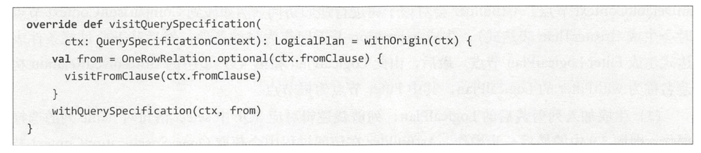
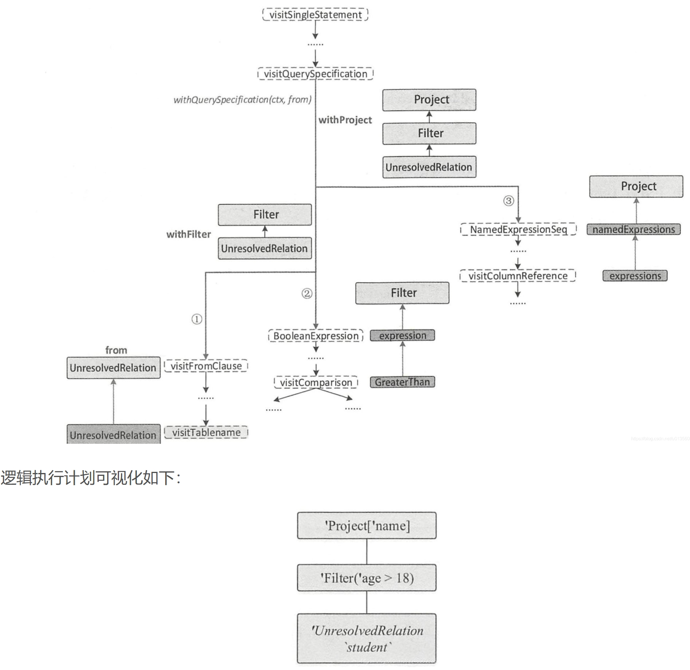
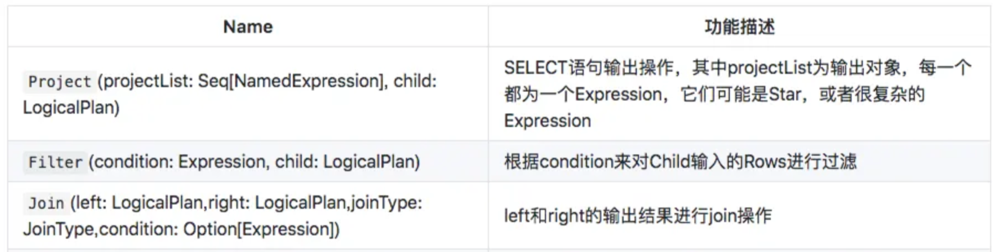
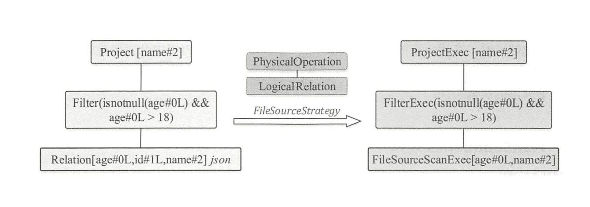
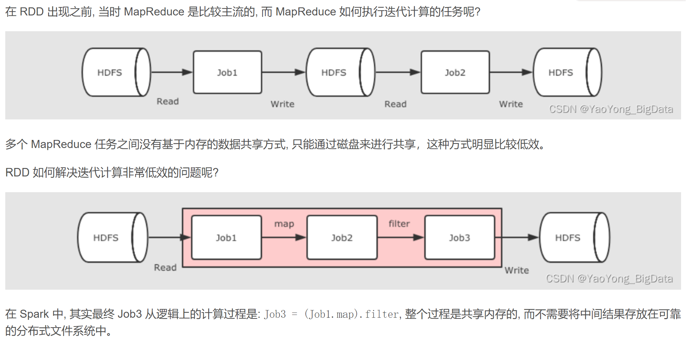
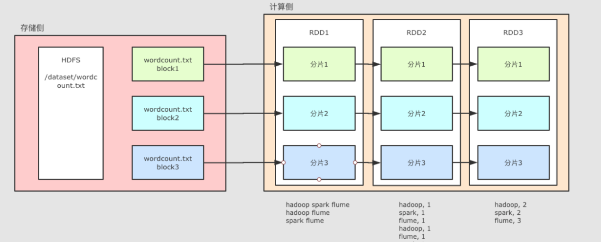

## 逻辑执行树
### 代码是怎么变成逻辑执行树的？
```select name from student where age >18;```

QuerySpecificationContext需要按照顺序遍历三个分支，生成逻辑执行计划，其访问方法为visitQuerySpecification，源码如下：

1. 解析from分支，对应第三行的代码

2. 解析where中的过滤条件expresstion,创建Filter 逻辑执行计划（谓词下推）

3. 解析select *  部分，对最后的输出，进行列的裁剪，创建Project 逻辑执行计划(列裁剪)

4. 构建完整化逻辑执行计划
   


这些节点都是 LogicalPlan 类型的， 可以理解为进行各种操作的 Operator， spark sql 对应各种操作定义了各种 Operator。


### 逻辑执行树是怎么变成物理执行树的？
todo: 逻辑到物理执行，做剪枝和谓词下沉。中间经过了什么。code怎么写的，比如结构体，封装的优化。可能有专业名词。具体代码。优化可以解决哪一类问题，哪些不行。having的谓词下沉。

```
Project [name]
+- Filter (age > 18)
   +- Scan "student"
```
```
Project [name]
+- Filter (age > 18)
   +- Scan "student"
```
## RDD
RDD 是一个抽象类
+ 一个分区的列表（getPartitions）
+ 一个用于计算分区中数据的函数（compute）
+ 一个对其他 RDD 的依赖列表（getDependencies）
+ 数据和计算之间的映射关系就存储在RDD中。


### RDD是弹性数据集，“弹性”体现在哪里呢？

+ 自动进行内存和磁盘切换
+ task如果失败会特定次数的重试：计算出错重试机制;
+ stage如果失败会自动进行特定次数的重试，而且只会只计算失败的分片
+ checkpoint【每次对RDD操作都会产生新的RDD，如果链条比较长，计算比较笨重，就把数据放在硬盘中】和persist 【内存或磁盘中对数据进行复用】(检查点、持久化)
+ 数据调度弹性：DAG TASK 和资源管理无关
    + 可以在同一个RDD上多次调用不同的行动操作，每次都会生成一个新的DAG任务
+ 数据分片的高度弹性repartion：可根据需要重新分片。
    + 可以显式地更改RDD的分区数，从而重新分配数据
    + 可以使用partitionBy操作将数据根据键进行分区

### RDD vs HDFS

RDD如何对一个HDFS的单一文件进行并行计算？


+ 对于 HDFS 中的文件, 是分为不同的 Block 的；
+ RDD 并没有真实的存放数据, 数据是从 HDFS 中读取的, 在计算的过程中读取即可；
+ 因为HDFS中的文件就是分片的, RDD 分片的意义在于表示对源数据集再次进行分片的计算, RDD 可以分片也意味着 可以并行计算。
### RDD的弹性

#### 分区的弹性:计算出错重试机制;

#### 计算的弹性:计算出错重试机制;

RDD1 → RDD2 → RDD3 这个过程中, RDD2 出错了, 有两种办法可以解决：

+ 缓存 RDD2 的数据, 直接恢复 RDD2, 类似 HDFS 的备份机制；
+ 记录 RDD2 的依赖关系, 通过其父级的 RDD 来恢复 RDD2, 这种方式会少很多数据的交互和保存。

如何通过父级 RDD 来恢复?

1. 记录 RDD2 的父亲是 RDD1；

2. 记录 RDD2 的计算函数, 例如记录 RDD2 = RDD1.map(…​), map(…​) 就是计算函数；

3. 当 RDD2 计算出错的时候, 可以通过父级 RDD 和计算函数来恢复 RDD2。

假如任务特别复杂, 流程特别长, 有很多 RDD 之间有依赖关系, 如何优化?
<details>
<summary>展开</summary>
上面提到了可以使用依赖关系来进行容错, 但是如果依赖关系特别长的时候, 这种方式其实也比较低效, 这个时候就应该使用另外一种方式, 也就是记录数据集的状态。

在 Spark 中有两个手段可以做到：

+ 缓存

+ Checkpoint
</details>