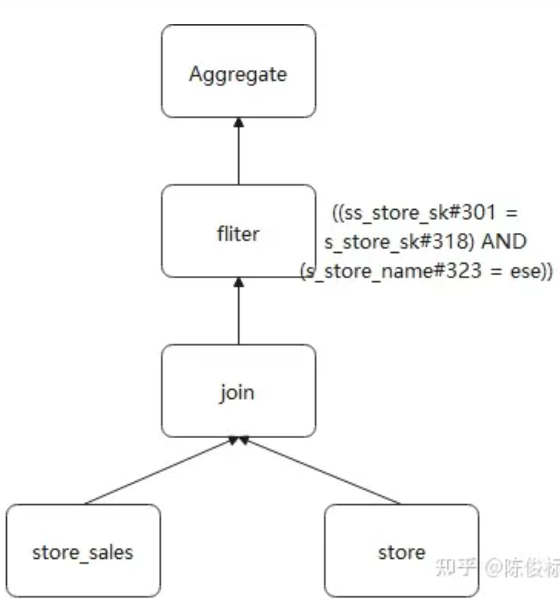
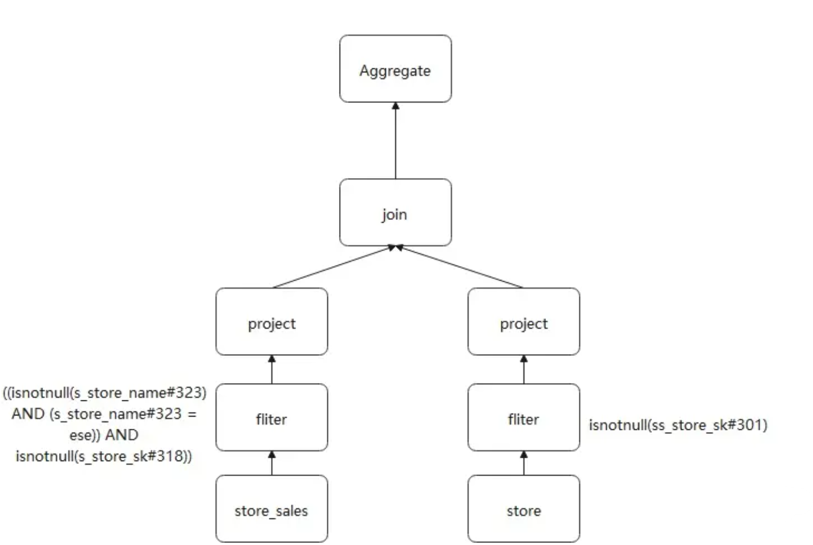

# 流程图
```
SELECT sum(v)
    FROM (
      SELECT
        t1.id,
    1 + 2 + t1.value AS v
    FROM t1 JOIN t2
      WHERE
    t1.id = t2.id AND
    t1.cid = 1 AND
    t1.did = t1.cid + 1 AND
      t2.id > 5) iteblog
```
# 逻辑执行计划
是先进行filter还是先进行join呢？
+ 返回project sum(v)
+ 返回project id和value
+ filter 各种
+ Join
+ UnresolvedRelation t1 + UnresolvedRelation t2

## Unresolved LogicalPlan 转换到 Analyzed Logical Plan 
+ Project sum --> Aggragate
+ t1.id = t2.id  --> id#0 = id#8
+ UnresolvedRelation t1  --> id#0 value#1
  
  t1 和 t2 表已经解析成带有 id、value、cid 以及 did 四个列的表，其中这个表的数据源来自于 csv 文件。而且每个列的位置和数据类型已经确定了

## 优化后的逻辑执行计划
### 谓词下推
什么是谓词：where后面的操作。

谓词下推（Predicate PushDown），即将查询的过滤条件尽可能下沉到数据源。目的是为了减少非必须数据的读取。比如做完筛选之后再做join操作，可能就能从十万条变成一万条。


通过对比，下推后，filter算子距离数据表更近了，这个就是谓词下推。
### 列裁剪 Column Pruning 
列裁剪和映射下推的目的：过滤掉查询不需要使用到的列
列裁剪ColumnPruning 指把那些查询不需要的字段过滤掉，使得扫描的数据量减少。
### 常量替换
SELECT * FROM table WHERE i = 5 AND j = i + 3 可以转换成 SELECT * FROM table WHERE i = 5 AND j = 8
### 常量累加
1+2 = 3


# 物理执行计划
+ Aggragate --> HashAggregate
+ Join --> BroadHashJoin
+ Join前加上一个BroadcastExchange，可以对小表进行广播。因为之后要做BroadHashJoin，就先做了BroadcastExchange，再做下一步的join连接操作。


# WholeStageCodegen
最后变成Spark可执行的。
把图片反过来，比如就是先filter 然后join 然后返回project，第一步加上scan，最后一步加上result。

  ### Volcano Iterator Model
  每个算子在底层都实现同样的接口，比如都实现了 next() 方法，然后最顶层的算子 next() 调用子算子的 next()，子算子的 next() 在调用孙算子的 next()，直到最底层的 next()

### Whole-stage Code Generation Function
整个查询计划被编译成一个函数 Whole-stage Code Generation Function。在该函数内部，数据被读取，然后进行过滤和投影操作，最终返回结果。这个函数会被一次性执行，避免了多个操作符之间的函数调用。

需要注意的是，Whole-stage Code Generation 需要考虑到所有操作符的逻辑，并将其合并为一个代码块。这通常需要一定的优化策略和代码生成技巧，但一旦成功，可以显著提高查询性能，特别是在处理大规模数据时。

#### 优点
+ 没有虚函数调度：在 Volcano 模型中，要处理元组需要next()至少调用该函数一次。这些函数调用由编译器作为虚拟函数调度（通过 vtable）实现。另一方面，手写代码没有单个函数调用。尽管虚拟函数调度一直是现代计算机体系结构中重点优化的领域，但它仍然需要多个 CPU 指令，并且速度可能相当慢，尤其是在调度数十亿次时。
+ 内存中的中间数据与CPU寄存器中的中间数据：在Volcano模型中，每次一个运算符将一个元组传递给另一个运算符时，都需要将该元组放入内存（函数调用堆栈）中。相比之下，在手写版本中，编译器（本例中为 JVM JIT）实际上将中间数据放置在 CPU 寄存器中。同样，CPU 访问内存中的数据所需的周期数比寄存器中的数据大几个数量级。
  
  + 寄存器是位于CPU内部的一组存储单元，用于临时存储和快速访问数据。它们与CPU紧密集成，因此访问寄存器的延迟非常低。

  + 相比之下，内存是位于主存储器中的数据存储区域，通常比寄存器的访问速度慢得多。
+ 循环展开和 SIMD：现代编译器和 CPU 在编译和执行简单的 for 循环时非常高效。编译器通常可以自动展开简单循环，甚至生成 SIMD 指令来处理每个 CPU 指令的多个元组。CPU 具有流水线、预取和指令重新排序等功能，可提高简单循环的执行效率。然而，这些编译器和 CPU 并不擅长优化 Volcano 模型所依赖的复杂函数调用图。

# Spark DAG图
```           
                              WholeStageCodegen_1 --> Exchange --> HashAggregate
             
WholeStageCodegen --> Exchange -->WholeStageCodegen_1 
```
WholeStageCodegen_1:
```
Filter --> Project --> Join -->Project --> HashAggragate
```


## Cache操作
如果数据被缓存在内存中（例如，使用缓存或者将数据加载到内存中），那么 InmemoryTableScan 可能被使用，它表示数据可以从内存中快速读取，而不是从磁盘中读取。

## 多个WholeStageCodegen的情况


EXP L1(org.bingviz.mt.dw.layers.topics.exp.ProduceExpL1$)
```
Scan parquet bingviz.xx
WholeStageCodegen
InmemoryTableScan
WholeStageCodegen
Exchange
```
代码
``` 

select all ： 
expl1 = spark.sql(
      s"""
         | SELECT t.`(date)?+.+`
         | FROM bingviz.$SrcTableName as t
         | WHERE date = '$date'
         |""".stripMargin)

expl1.cache()

expl1.filter ：
val expl1Core = expl1.filter(udfIsExPCoreEvent(col("event_name"), col("event_type")))

expl1Core.repartition：
expl1Core.repartition(BingVizDWConstants.PartitionXHigh, col("install_id"))
      .write
      .mode(SaveMode.Overwrite)
      .parquet(adlCosmosExpL1KeyTotalPath)

```
#### 为什么有两个exchange？
一个是mappartition，一个是shufflepartition。如果这个map后面涉及了重新分区。就会出现在exchange里面。如果只是map就会在wholecodestagegen里面，wholecodestagegen自己给它做优化

#### Code，Job，Stage，Excutor和Task之间的关系？

一个文件里面可能有多个job，比如L1就是3个。点进去，每个job有几个stage。比如164行有2个stage。每个红色框框是一个stage。每个stage里面都有100个excutor和200-8000个task。每个excutor里面有2-N个task在运行。